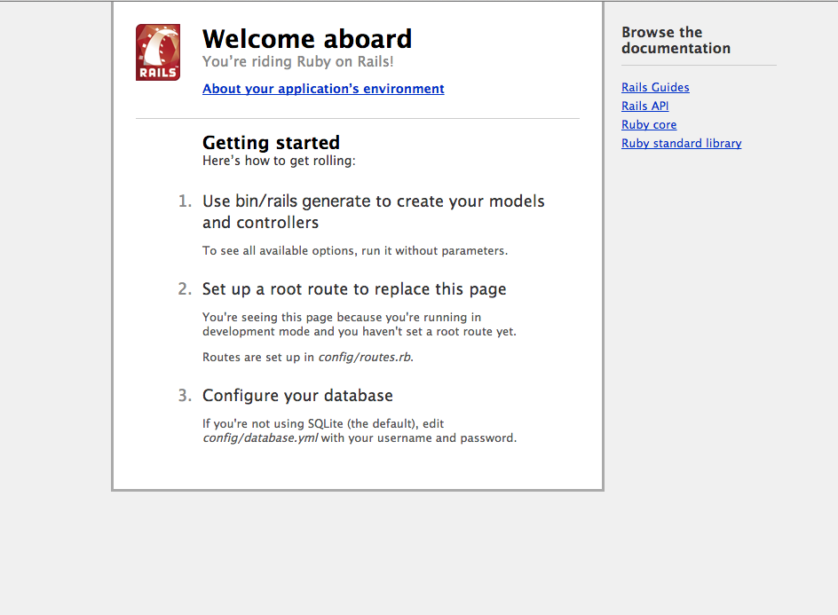

# Railsのインストール

```
sudo gem install rails -v 4.2.4
```

# 作業ディレクトリの作成

```
mkdir workspace
cd workspace
```

# Railsプロジェクトの作成

```
rails _4.2.4_ new hello_app
```

# Bundler周りの話

無駄に不都合が起きないように、バージョンを固める。

```ruby
source 'https://rubygems.org'

gem 'rails',                '4.2.4'
gem 'sass-rails',           '5.0.2'
gem 'uglifier',             '2.5.3'
gem 'coffee-rails',         '4.1.0'
gem 'jquery-rails',         '4.0.3'
gem 'turbolinks',           '2.3.0'
gem 'jbuilder',             '2.2.3'
gem 'sdoc',                 '0.4.0', group: :doc

group :development, :test do
  gem 'sqlite3',     '1.3.9'
  gem 'byebug',      '3.4.0'
  gem 'web-console', '2.0.0.beta3'
  gem 'spring',      '1.1.3'
end
```

# Rails Serverの起動

Vagrant上でRails serverを立てる

```
rails server -b 0.0.0.0
```

もしくは

```
rails s -b 0.0.0.0
```

0.0.0.0にしているのは、ホストOSからブラウザで確認するため。

`http://192.168.44.10:3000` とか設定してあったアドレスにport3000でアクセスしたらRailsっぽい画面が見れる。

portも変えたければ `-p <port>` とオプションを追加すれば可能。



# RailsはMVC

はい。`app/` に軒並みある

# hello world

```ruby
def hello
    render text: "hello, world!"
  end
```

`hello, world!` と画面に表示するサンプル

## ルートに設定

`config/routes.rb` で指定する

```ruby
root 'application#hello'
```

applicationコントローラーのhelloメソッドを登録する感じ

これで`/`にアクセスした時にはhelloアクションが呼ばれる

# Gitの話

スルー

# Herokuの話

うーん、ここはいいや

# 演習

```
リスト1.8のhelloアクションを書き換え、「Hello, world!」の代わりに「hola, mundo!」と表示されるようにしてみましょう。
課外作業: Railsの表示では「非ASCII文字」もサポートされています。スペイン語特有の逆さ感嘆符「¡」を含む「¡Hola, mundo!」を表示してみましょう (図1.19)20。

リスト1.8のhelloアクションを複製して、第2のアクションgoodbyeを追加しましょう。
このアクションは、「goodbye, world!」というテキストを表示します。
リスト1.10のルーティングを編集して、ルートルーティングの割り当て先をhelloアクションからgoodbyeアクションに変更します (図1.20)。
```
