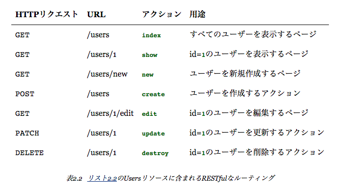

# config/routes.rb
 
```ruby
Rails.application.routes.draw do
  resources :users
  root 'users#index'
  ...
``` 

と変えてあげればさっき作成した`/users`がrootになる

# controllerに実装されたメソッドを見てみる

RESTアーキテクチャを構成している



# scaffoldで作られたコードの問題点

scaffoldで作成したUsersリソースは、Railsの概要を手っ取り早く説明するには良いのですが、以下のようなさまざまな問題点を抱えています。

* データの検証が行われていない。
  * このままでは、ユーザー名が空欄であったり、でたらめなメールアドレスを入力したりしても通ってしまいます。
* ユーザー認証が行われていない。
  * ログイン、ログアウトが行われていないので、誰でも無制限に操作できてしまいます。
* テストが書かれていない。
  * 厳密にはこれは正しい表現ではありません。というのも、scaffoldで生成したコードにはごく簡単なテストが一応含まれているからです。ただ、scaffoldのテストコードはデータ検証やユーザー認証、その他の必要な要求を満たしていません。
* レイアウトやスタイルが整っていない。
  * サイトデザインも操作法も一貫していません。
* 理解が困難。
  * scaffoldのコードを理解できるぐらいなら、そもそも本書を読む必要はないでしょう。
  
こういったあたりをこの後埋めていくのかな

# Microposts リソース

次はmicroposts周りを進めていく。

まずはgenerateから

```
rails generate scaffold Micropost content:text user_id:integer
```

```
bundle exec rake db:migrate
```


