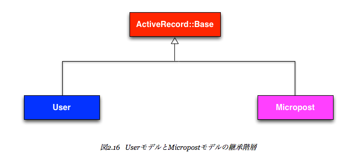
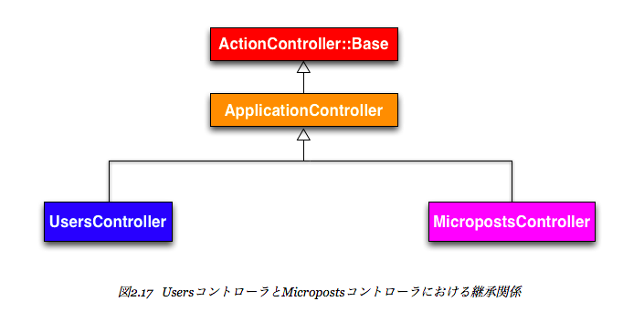

# Micropostsを文字通りマイクロにする

文字数制限を行うために、validationを行っていく。

## app/models/micropost.rb

```ruby
class Micropost < ActiveRecord::Base
  validates :content, length: { maximum: 140 }
end
```

Railsのバリデーションはこういう風に書ける

もろもろは http://railsguides.jp/active_record_validations.html のあたりをみればよさそう

# ユーザーとマイクロポストをhas_manyで関連付ける

リレーションをRailsでは次のように表せる

詳しくは http://railsguides.jp/association_basics.html このあたり参照

## app/models/user.rb

```ruby
class User < ActiveRecord::Base
  has_many :microposts
end
```

## app/models/micropost.rb

```ruby
class Micropost < ActiveRecord::Base
  belongs_to :user
  validates :content, length: { maximum: 140 }
end
```

# rails console

Railsアプリケーションを対話的に操作することが可能な便利ツール

irbが立ち上がっていい感じに扱える

# 継承の階層





# 2章のまとめ

## 良い点

* Rails全体を高度なレベルで概観できた
* MVCモデルを紹介できた
* RESTアーキテクチャに初めて触れた
* データモデルの作成を初めて行った
* データベースを背後に持つWebアプリケーションを本番環境で動かした

## 課題

* レイアウトもスタイルも設定されていない
* “Home” や “About” のような定番の静的なページがない
* ユーザーがパスワードを設定できない
* ユーザーが画像を置けない
* ログインのしくみがない
* セキュリティのためのしくみがまったくない
* ユーザーとマイクロポストの自動関連付けが行われていない
* Twitterのような「フォロワー (following)機能」や「フォロー中 (followed)機能」がない
* マイクロポストをフィードできない
* まともなテストがない
* 理解が困難


今後は、これらの課題をひとつずつ潰していく流れになるっぽい

## まとめ

* Scaffold機能でコードを自動生成すると、Webのあらゆる部分からモデルデータにアクセスしてやりとりできるようになる。
* Scaffoldは何よりも手っ取り早いのがとりえだが、これを元にRailsを理解するには向いていない。
* RailsではWebアプリケーションの構成にMVC (Model-View-Controller) というモデルを採用している。
* Railsが解釈するRESTには、標準的なURLセットと、データモデルとやりとりするためのコントローラアクションが含まれている。
* Railsではデータのバリデーション (validation) がサポートされており、データモデルの属性の値に制限をかけることができる。
* Railsには、さまざまなデータモデル同士を関連付けを定義するための組み込み関数が多数用意されている。
* Railsコンソールを使用すると、コマンドラインからRailsアプリケーションとやりとりすることができる。