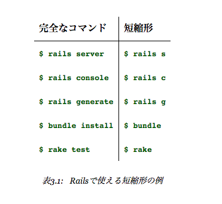

# ほぼ静的なページの作成

別アプリケーションを作成して、そこで作業するようにする。

```
rails _4.2.4_ new sample_app
```

## Gemfile

```ruby
source 'https://rubygems.org'


# Bundle edge Rails instead: gem 'rails', github: 'rails/rails'
gem 'rails', '4.2.4'
# Use SCSS for stylesheets
gem 'sass-rails', '5.0.2'
# Use Uglifier as compressor for JavaScript assets
gem 'uglifier', '2.5.3'
# Use CoffeeScript for .coffee assets and views
gem 'coffee-rails', '4.1.0'
# See https://github.com/rails/execjs#readme for more supported runtimes
# gem 'therubyracer', platforms: :ruby

# Use jquery as the JavaScript library
gem 'jquery-rails', '4.0.3'
# Turbolinks makes following links in your web application faster. Read more: https://github.com/rails/turbolinks
gem 'turbolinks', '2.3.0'
# Build JSON APIs with ease. Read more: https://github.com/rails/jbuilder
gem 'jbuilder', '2.2.3'
# bundle exec rake doc:rails generates the API under doc/api.
gem 'sdoc', '0.4.0', group: :doc

# Use ActiveModel has_secure_password
# gem 'bcrypt', '~> 3.1.7'

# Use Unicorn as the app server
# gem 'unicorn'

# Use Capistrano for deployment
# gem 'capistrano-rails', group: :development

group :development, :test do
  # Use sqlite3 as the database for Active Record
  gem 'sqlite3', '1.3.9'
  # Call 'byebug' anywhere in the code to stop execution and get a debugger console
  gem 'byebug', '3.4.0'
  # Access an IRB console on exception pages or by using <%= console %> in views
  gem 'web-console', '2.0.0.beta3'
  # Spring speeds up development by keeping your application running in the background. Read more: https://github.com/rails/spring
  gem 'spring', '1.1.3'
end
```

これらのgemを使う模様。

# コントローラーの生成

```
rails generate controller StaticPages home help
```

このように引数を渡せばhomeアクション、helpアクションも自動生成できる。

# railsコマンドの短縮形

これからは短縮形を使っていく



# railsの「あれこれを元に戻す」方法

## 自動生成を元に戻す

```
rails destroy <生成時に渡した引数>
```

とやれば元に戻る。

先ほどのコントローラー生成なら

```
rails destroy controller StaticPages home help
```

で元に戻せる

## マイグレーションを元に戻す

マイグレーションを一つ戻すなら

```
bundle exec rake db:rollback
```

マイグレーションをすべて戻すなら

```
bundle exec rake db:migrate VERSION=0
```

マイグレーションを一からやり直すなら

```
bundle exec rake db:migrate:reset
```
