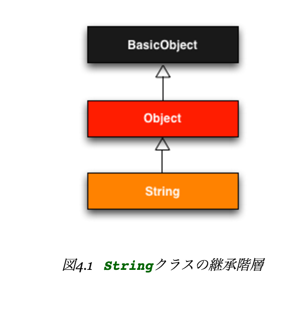

# Rails風味のRuby

titleを各ページで与えなかった場合、`:title`が空になってしまい、`| Ruby on Rails Tutorial Sample App`というタイトルになってしまい微妙。

これをタイトルが空なときは余計な縦棒を追加しないようにしたい。

そのためにfull_titleというヘルパーを作成する。

# app/helpers/application_helper.rb

```ruby
module ApplicationHelper

  # ページごとの完全なタイトルを返す
  def full_title(page_title = '')
    base_title = "Ruby on Rails Tutorial Sample App"
    if page_title.empty?
      base_title
    else
      page_title + " | " + base_title
    end
  end
end
```

これをapplication.html.erbで使ってあげれば、page_titleとbase_titleをよしなにうまく利用したタイトルが出来上がるようになる

ぼちぼち要点だけメモるようにして、学習効率をあげよう

* ヘルパーを使ってviewでのちょっとした加工などを行おう(viewでのmodel的な)

# 文字列とメソッド

* 学習ツールとして素晴らしいrails console

# 他のデータ構造

## 配列

* `a << "foo" << "bar"        # 配列に連続して追加する` こんな記法も可能

## ブロック

## ハッシュとシンボル

* 以下は等価。

```ruby
{ :name => 'Michael Hartl' }
```

```ruby
{ name: 'Michael Hartl' }
```

* シンボルは`-`は使えない

* ハッシュもeachメソッドに応答する。

```ruby
flash = { success: 'It worked!', danger: 'It failed' }

flash.each do |key, value|
  # ...
end
``` 

* inspectメソッド

  * 要求されたオブジェクトを表現する文字列を返す。
  
  ```ruby
  "It worked!".inspect
  ```
  
## CSS、再び

* Rubyは丸括弧を使わなくてもOK
* ハッシュが最後の引数であるときは波括弧は省略OK
* Rubyは改行と空白を区別しない

# Rubyにおけるクラス

* すべてのオブジェクトはBasicObjectを継承している



* 回文は英語で`palindrome`

```ruby
class Word
  def palindrome?(string)
    string == string.reverse
  end
end
```

# 演習


